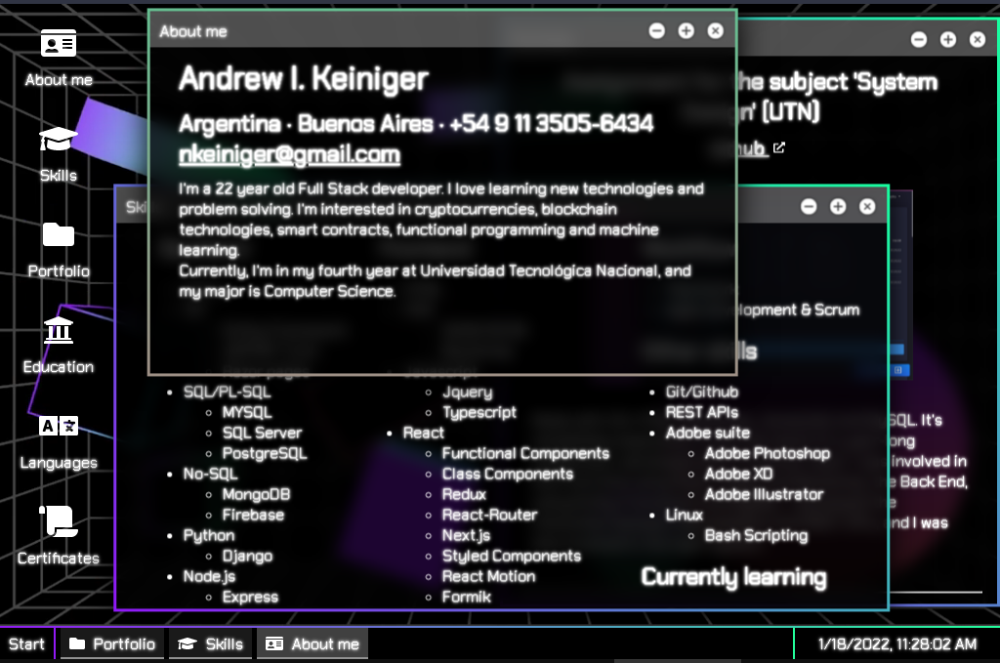

# 🖥 [CurriCoolum](https://keiniger.netlify.app/) 

My personal résumé, built from scracth by me in the React framework :)

URL: [https://keiniger.netlify.app/](https://keiniger.netlify.app/)

Made by Ignacio Keiniger